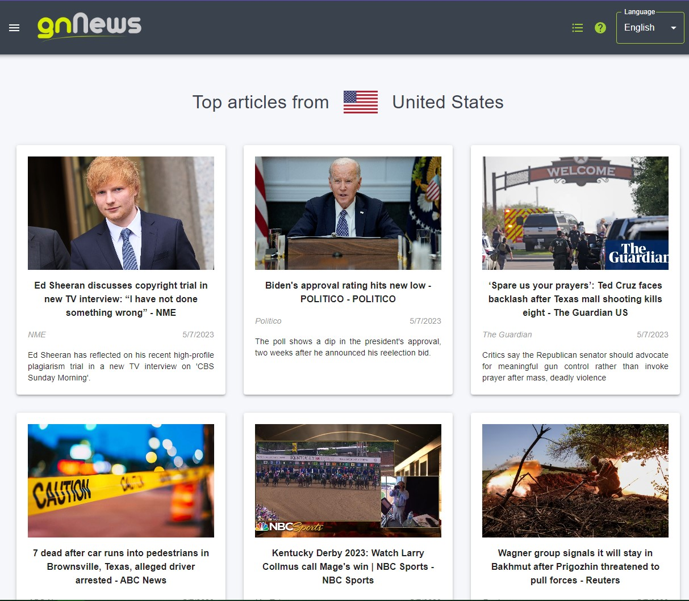
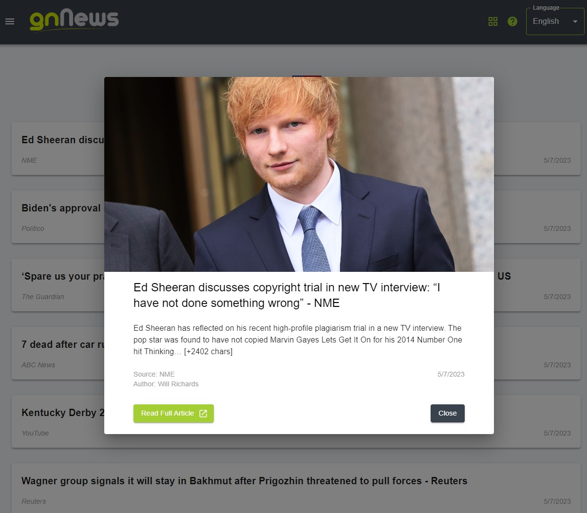

# gnNews Application

[](https://reactjs.org/)
[](https://www.typescriptlang.org/)
[](https://redux-toolkit.js.org/)
[](https://react.i18next.com/)
[](https://mui.com/)
[](https://testing-library.com/)

A news application built using React 18, TypeScript 4, Redux Toolkit, and MUI, fetching news data from the [News API](https://newsapi.org/v2). The application features a header, side menu, main content, and footer, with an additional language-switching functionality created wtih i18n.

## Demo Link

Access the app at https://gnnews.wozniakkamil.com

## Table of Contents

- [Features](#features)
- [Screenshots](#screenshots)
- [Installation](#installation)
- [Usage](#usage)

## Features

- View news articles in a list or grid layout.
- Filter news by country.
- Display news details in a popup.
- Change the application language (Polish and English are supported).
- Footer with the current time and the amount of articles on the page.
- Fully responsive design.

## Screenshots






## Installation

To get started, clone the repository and install the dependencies:

```bash
git clone https://github.com/WoXuS/gn-news
cd gnnews-app
npm install
```

## Usage

To start the development server, run:

```bash
npm start
```

Open http://localhost:3000 to view the registration module in your browser.